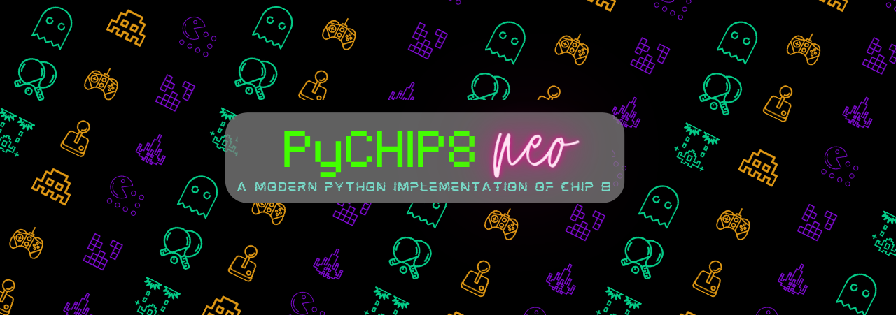
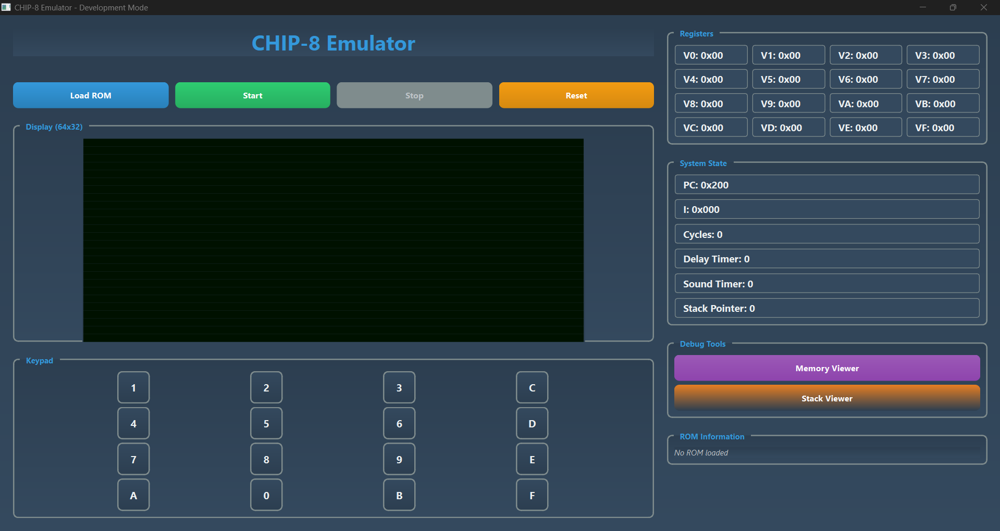
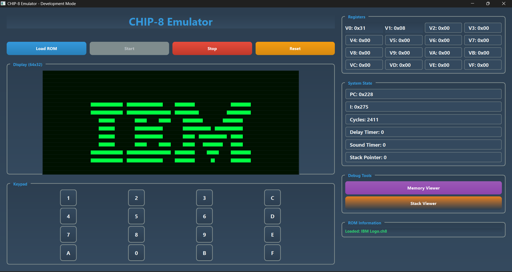
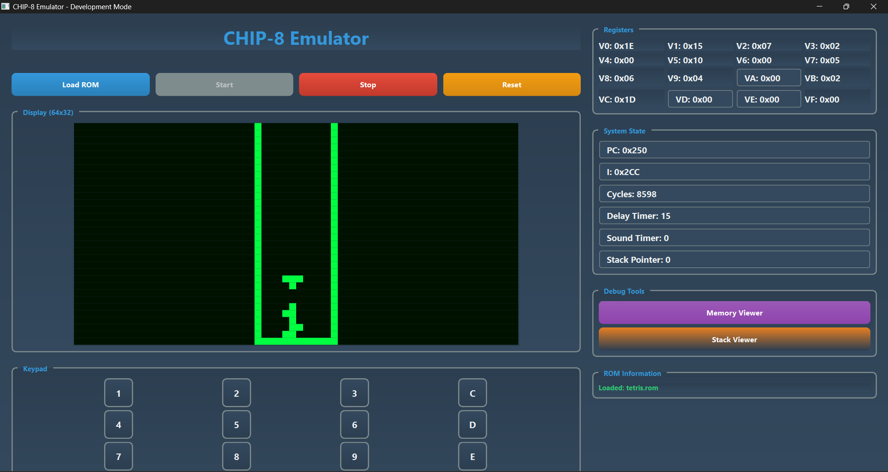

# pyCHIP8-neo



A modern CHIP-8 emulator built with Python and PyQt6, featuring a development GUI for debugging and ROM management.

## Features

- 🎮 Full CHIP-8 instruction set emulation
- 🖥️ PyQt6-based GUI with debugging capabilities
- 📁 Built-in ROM library with classic games
- 🔧 Development mode with step-by-step execution
- ⚡ Configurable execution cycles

## Screenshots

### Development Interface


### Games in Action
#### IBM Logo Demo


#### Tetris Game


## Quick Start

### Prerequisites

- Python 3.10 or higher
- [uv](https://docs.astral.sh/uv/) package manager

### Installation

```bash
pip install uv
uv sync
```

### Usage

Launch the emulator:
```bash
python main.py
```

Load a specific ROM:
```bash
python main.py --rom roms/tetris.rom
```

Run with limited cycles (useful for debugging):
```bash
python main.py --rom roms/pong.rom --cycles 1000
```

## Command Line Options

| Flag | Short | Description | Default |
|------|-------|-------------|---------|
| `--rom` | `-r` | Path to CHIP-8 ROM file | None |
| `--cycles` | `-c` | Max CPU instructions to execute | Infinite |

## Included ROMs

The `roms/` directory contains several classic CHIP-8 games:
- Tetris
- Pong
- Breakout (br8kout)
- Flight Runner
- IBM Logo demo
- And more...

## Project Structure

```
pyCHIP8-neo/
├── main.py           # Entry point
├── emulator/         # Core emulation logic
├── runtime/          # GUI and development tools
├── roms/            # CHIP-8 ROM files
└── test/            # Test files
```

## License

This project is open source. See the project files for more details.